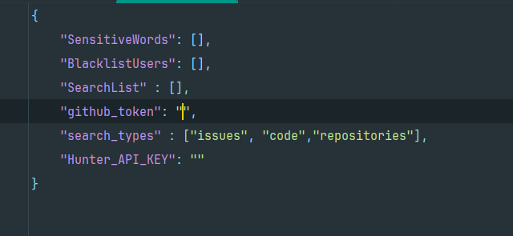

# LeakGuard - Check Your Emails and Passwords

​												

[中文][url-doczh]

## Introduction

A tool implemented in Python3 for detecting email and password leaks, as well as keyword detection on GitHub and Google, supporting bulk detection.

Features include:

- Email leak detection
- Password leak detection
- GitHub keyword detection (supports custom blacklist)
- Google keyword detection
- Added hunter.io email detection

## Features

- **Bulk Detection**: Capable of checking multiple emails or passwords for leaks across data breaches or on GitHub and Google simultaneously.
- **User-Friendly**: A simple command-line interface that is easy to operate.
- **Python Implementation**: Written in Python, cross-platform compatibility.
- **Beautiful Output**: Customizable output format for better readability.

## Usage

Prerequisite: **Use** **`python3`** **version to run**， and configure the `config.json` file:




1. **Download the Project**:

```
git clone https://github.com/AgonySec/LeakGuard
```

2. **Configure Dependencies**:

   Ensure Python environment is installed. Then install the required dependencies via pip:

```go

pip3 install -r requirements.txt
```

3. **Run the Tool**:  
   Execute the script via command line and pass the file containing the emails or passwords you want to test:

```python
python main.py

usage: main.py [-h] [-e EMAIL] [-ef EMAIL_FILE] [-p PASSWORD] [-pf PASSFILE] [-o OUTPUT] [-c] [-bU BU] [-sW SW]
               [-google GOOGLE_SEARCH] [-ggf GOOGLE_FILE] [-github GITHUB_SEARCH] [-gtf GITHUB_FILE]
               [-hunter HUNTER_SEARCH] [-m {json,xlsx}]

LeakGuard 邮箱、密码泄露和关键字 综合检测工具 By Agony

options:
  -h, --help            show this help message and exit
  -e EMAIL, --email EMAIL
                        输入要测试的邮箱地址
  -ef EMAIL_FILE, --email_file EMAIL_FILE
                        输入包含多个邮箱地址的文件路径
  -p PASSWORD, --password PASSWORD
                        输入要测试的密码
  -pf PASSFILE, --passFile PASSFILE
                        输入包含多个密码的文件路径
  -o OUTPUT, --output OUTPUT
                        输出文件名，不包含后缀，默认为Google_email_timestamp.json
  -c                    信息收集模式
  -bU BU                设置黑名单用户文件
  -sW SW                设置敏感词文件
  -google GOOGLE_SEARCH, --google_search GOOGLE_SEARCH
                        指定要提取的邮箱后缀，例如 @qq.com, 从Google搜索中提取指定域名邮箱
  -ggf GOOGLE_FILE, --google_file GOOGLE_FILE
                        从txt文件中读取邮箱后缀,进行谷歌搜索
  -github GITHUB_SEARCH, --github_search GITHUB_SEARCH
                        指定关键字,进行GitHub搜索
  -gtf GITHUB_FILE, --github_file GITHUB_FILE
                        指定关键字文件,进行GitHub批量搜索
  -hunter HUNTER_SEARCH, --hunter_search HUNTER_SEARCH
                        输入网站域名，hunter.io搜索邮箱
  -m {json,xlsx}, --mode {json,xlsx}
                        指定输出格式，支持 json 或 xlsx，默认为 xlsx
```


## Note

- It is necessary to clarify that **the logic for detecting password leaks here is actually comparing the password you input against publicly leaked data; if they match, it is considered a password leak! This has nothing to do with the email account being checked!**
- The author is a beginner, and there are many unreasonable parts in the code, which have not been changed yet. Please be lenient, experienced developers.
- Initially, this was just an email leak detection tool, but as features expanded to include GitHub and Google keyword searches, it has become somewhat bloated...

## Contributing

Contributions to this project are welcome. If you find any issues or have suggestions for new features, please submit them via GitHub Issues.

## License

This project is licensed under the [MIT License](LICENSE).

---

Thank you for using pwned_tool!

---

Please note that the images referenced in the document will need to be translated to their English file names or paths if they are to be used in an English context.

[url-doczh]: README.md