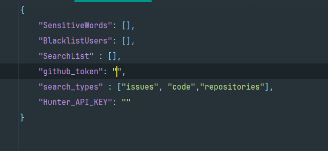

# **LeakGuard** - 检查你的邮箱和密码

​																											

[English][url-docen]

## 介绍

　　一款基于 Python3 实现的邮箱和密码泄露检测 以及 GitHub、谷歌 关键字检测 工具，支持批量检测

功能如下：

- 邮箱泄露检测
- 密码泄露检测
- GitHub关键字检测（支持自定义黑名单）
- 谷歌关键字检测
- 增加hunter.io 邮箱检测

## 功能特点

* **批量检测**：能够同时检测多个邮箱或密码是否在数据泄露或GitHub 、谷歌中出现过。
* **易于使用**：简洁的命令行界面，易于操作。
* **Python实现**：使用 Python 编写，跨平台运行。
* **输出美观**：自定义输出格式，更好的阅读浏览

## 使用方法

　　前提：**使用** **`python3`**  **版本 运行**  ，配置config.json文件：

如果要使用GitHub关键字搜索，需要配置GitHub的token：




1. **下载项目**： 

```
git clone https://github.com/AgonySec/LeakGuard
```

2. **配置依赖**：

   确保已安装 Python3 环境。然后通过 pip 安装所需的依赖库：

```go
pip3 install -r requirements.txt
```

3. **运行工具**：
   使用命令行工具运行脚本，并传入需要检测的邮箱或密码列表文件：

```python
python main.py

usage: main.py [-h] [-e EMAIL] [-ef EMAIL_FILE] [-p PASSWORD] [-pf PASSFILE] [-o OUTPUT] [-c] [-bU BU] [-sW SW]
               [-google GOOGLE_SEARCH] [-ggf GOOGLE_FILE] [-github GITHUB_SEARCH] [-gtf GITHUB_FILE]
               [-hunter HUNTER_SEARCH] [-m {json,xlsx}]

LeakGuard 邮箱、密码泄露和关键字 综合检测工具 By Agony

options:
  -h, --help            show this help message and exit
  -e EMAIL, --email EMAIL
                        输入要测试的邮箱地址
  -ef EMAIL_FILE, --email_file EMAIL_FILE
                        输入包含多个邮箱地址的文件路径
  -p PASSWORD, --password PASSWORD
                        输入要测试的密码
  -pf PASSFILE, --passFile PASSFILE
                        输入包含多个密码的文件路径
  -o OUTPUT, --output OUTPUT
                        输出文件名，不包含后缀，默认为Google_email_timestamp.json
  -c                    信息收集模式
  -bU BU                设置黑名单用户文件
  -sW SW                设置敏感词文件
  -google GOOGLE_SEARCH, --google_search GOOGLE_SEARCH
                        指定要提取的邮箱后缀，例如 @qq.com, 从Google搜索中提取指定域名邮箱
  -ggf GOOGLE_FILE, --google_file GOOGLE_FILE
                        从txt文件中读取邮箱后缀,进行谷歌搜索
  -github GITHUB_SEARCH, --github_search GITHUB_SEARCH
                        指定关键字,进行GitHub搜索
  -gtf GITHUB_FILE, --github_file GITHUB_FILE
                        指定关键字文件,进行GitHub批量搜索
  -hunter HUNTER_SEARCH, --hunter_search HUNTER_SEARCH
                        输入网站域名，hunter.io搜索邮箱
  -m {json,xlsx}, --mode {json,xlsx}
                        指定输出格式，支持 json 或 xlsx，默认为 xlsx

```

　　


## 注意

- 有必要解释清楚，**这里的检测密码泄露逻辑，其实是在拿你输入的密码在公开泄露情报中比较，如果相同则视为密码泄露！跟检测的邮箱账号毫无关联！**
- 作者纯菜鸡，代码有很多不合理的地方，目前也没更改，望各位大佬手下留情
- 起初只是一个邮箱泄露检测工具，后面功能越来越丰富，增加了GitHub、谷歌关键字搜索，就变成现在这个模样，感觉有些臃肿。。。

## 贡献

　　欢迎对本项目进行贡献。如果您发现任何问题或有新功能的建议，请通过 GitHub Issues 提交。

## 许可证

　　本项目采用 [MIT License](LICENSE) 许可证。

---

　　感谢使用 pwned_tool！

[url-docen]: README_EN.md
