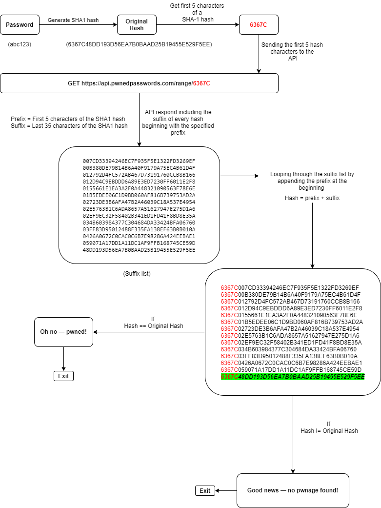
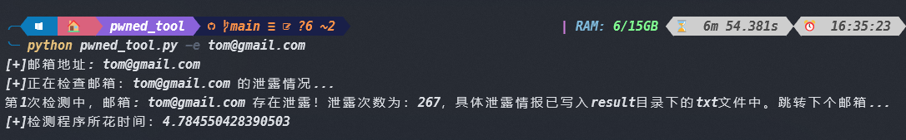
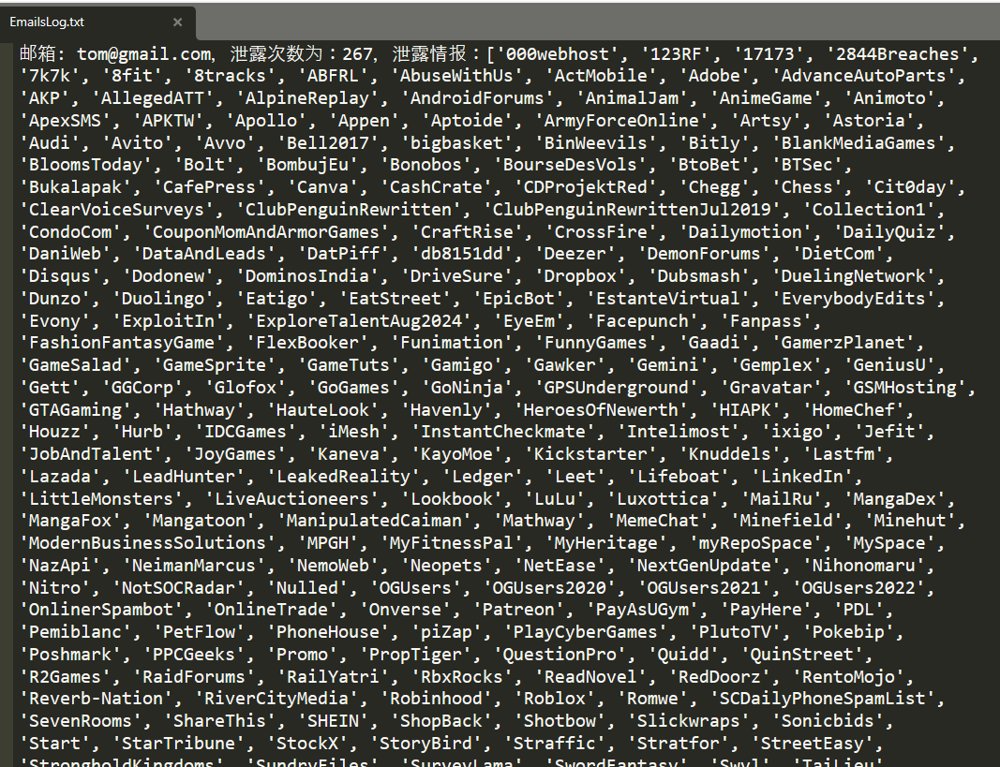
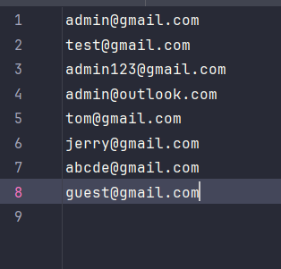
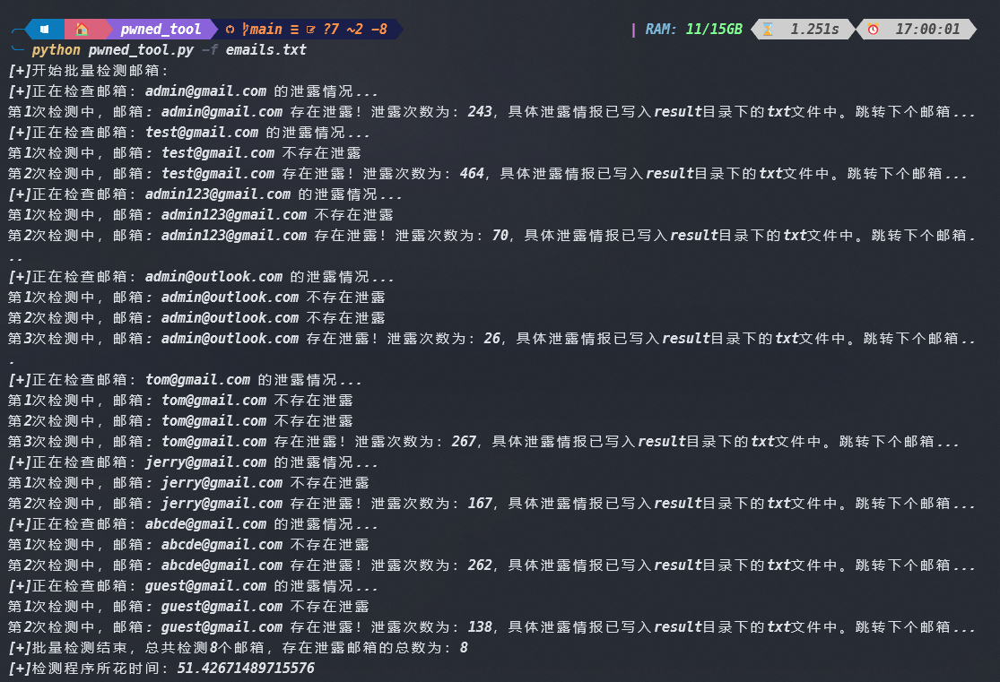
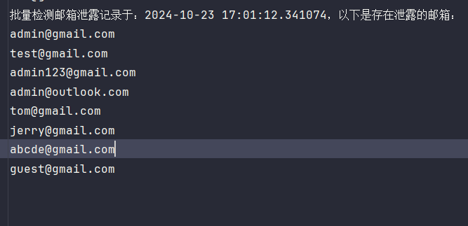
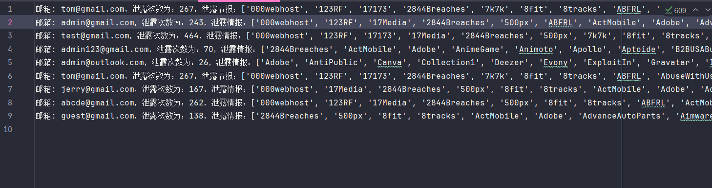
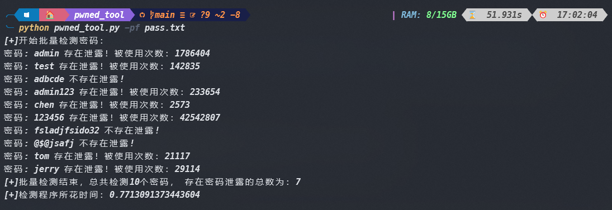
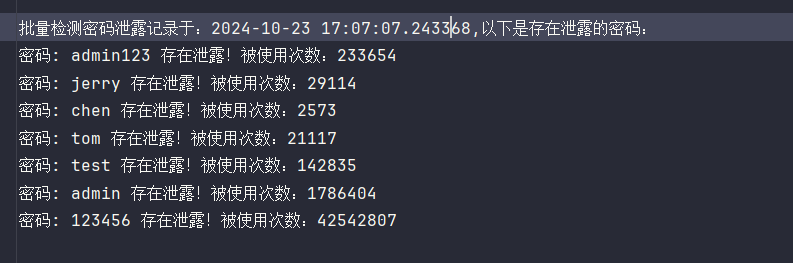

# Pwned_tool - 检查你的邮箱和密码

[English][url-docen]

## 介绍

　　一款基于 Python3 实现的邮箱和密码泄露检测工具，支持批量检测，采用`haveibeenbreached`​来验证邮箱泄露情况，此项目无需依赖官方付费API即可使用！密码验证采用的是`haveibeenpwned`​网站的API 。

　　密码验证使用的是`haveibeenpwned`​（haveibeenpwned.com）网站的API，此API使用的是“k-匿名“ 算法模型，这个算法强的的地方在于，只需要提供密码hash顺序的前5个字符，而不是全部，就能在不提交完整密码的情况下进行检索，查询这个密码是否有泄露的情况。**这就意味着不会让你的明文密码上传到网络上去检测！**

　　算法实现如下：

​

## 功能特点

* **批量检测**：能够同时检测多个邮箱或密码是否在数据泄露中出现过。
* **无需API**：直接使用，无需注册或请求官方 API。
* **易于使用**：简洁的命令行界面，易于操作。
* **Python实现**：使用 Python 编写，跨平台运行。

## 使用方法

　　前提：**使用** **​`python3`​**​  **版本 运行**

1. **下载项目**： 

```
git clone https://github.com/AgonySec/pwned_tool
```

2. **配置依赖**：

   确保已安装 Python 环境。然后通过 pip 安装所需的依赖库：

```go

pip3 install -r requirements.txt
```

3. **运行工具**：  
   使用命令行工具运行脚本，并传入需要检测的邮箱或密码列表文件：

```python
python pwned_tool.py
usage: pwned_tool.py [-h] [-e EMAIL] [-f FILE] [-p PASSWORD] [-pf PASSFILE]

options:
  -h, --help            show this help message and exit
  -e EMAIL, --email EMAIL
                        输入要测试的邮箱地址
  -f FILE, --file FILE  输入包含多个邮箱地址的文件路径
  -p PASSWORD, --password PASSWORD
                        输入要测试的密码
  -pf PASSFILE, --passFile PASSFILE
                        输入包含多个密码的文件路径

```

　　‍

## 示例

### 检测单个邮箱

```go
python pwned_tool.py -e tom@gmail.com
```



　　具体泄露情报存放在result目录下对应的EmailsLog.txt文件：



### 检测单个密码

```go
python pwned_tool.py -p admin123
```


　　‍

### 批量检测邮箱

　　假设您有一个包含邮箱的列表文件 `emails.txt`​，每行一个邮箱地址。



　　运行以下命令进行检测：

```go
python pwned_tool.py -f emails.txt
```



　　存在泄露的邮箱记录存放在当前目录下的`DataBreachEmailsLog.txt`​中：



　　具体泄露情报存放在result目录下对应的`EmailsLog.txt`文件：



　　	

### 批量检测密码

```go
python pwned_tool.py -pf pass.txt
```



　　将存在结果存放在当前目录下的`DataBreachPasswordsLog.txt`​中：



## 注意

有必要解释清楚，**这里的检测密码泄露逻辑，其实是在拿你输入的密码在公开泄露情报中比较，如果相同则视为密码泄露！跟检测的邮箱账号毫无关联！**

## 贡献

　　欢迎对本项目进行贡献。如果您发现任何问题或有新功能的建议，请通过 GitHub Issues 提交。

## 许可证

　　本项目采用 [MIT License](LICENSE) 许可证。

---

　　感谢使用 pwned_tool！

[url-docen]: README_EN.md
